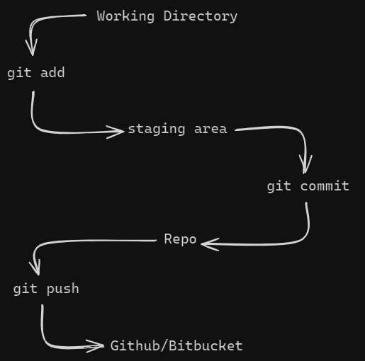
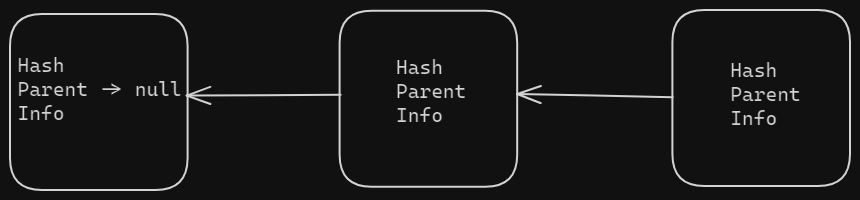

# Git Crash Course

```bash
git --version  # Version of git
git status     # Get the status of the git
git init       # To initialize the git on a project
```

- It creates a .git folder

## Git flow diagram



## Log commands

```bash
git log  # Details of the commits
git log --oneline  # Details of commits in one line
```

## Atomic commits - How the commit should be?

- Keep the commit to one feature, one component or one fix. <b>Focus on one thing.</b>
- Git message: Try to use present imperative, kind of giving order to git. (Although it is not mandatory)

## Git config

1. Setup username

```bash
git config --global user.name "username"
```

2. Setup email

```bash
git config --global user.email "email"
```

3. Change code editor

```bash
git config --global core.editor "code --wait"  # To setup VS code
```

## .gitignore

- Include all the files which should not be pushed to the repository.

## Where the git config will be present?

1. Go to the root folder

```bash
cat .gitconfig
```

## Commit behind the scene



## Git merge & Git commits

```bash
git branch  # Branch list
git branch  <<branch-name>>  # Create branch
git checkout <<branch-name>>  # Change branch
git switch -c <<branch-name>>  # Create and move to the branch
git checkout -b <<branch-name>>  # Create and move to the branch
```

## Merge the branch

1. Be on the branch where you want to merge.
2. Merge the feature branch with the current one.

```bash
git switch master
git merge bugfix
```

There are 2 types of merge

1. Fast forward merge
2. Not fast forward merge

```bash
git branch -d <<branch-name>> # Delete a branch
```
