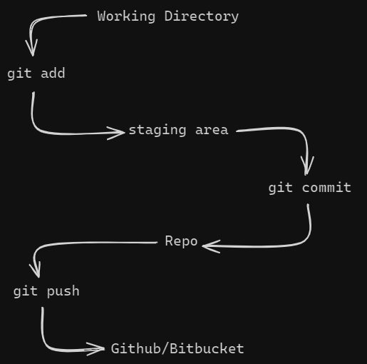
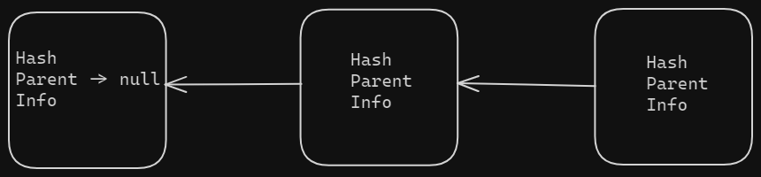

# Git Crash Course

```bash
git --version  # Version of git
git status     # Get the status of the git
git init       # To initialize the git on a project
```

- It creates a .git folder

## Git flow diagram



## Log commands

```bash
git log  # Details of the commits
git log --oneline  # Details of commits in one line
```

## Atomic commits - How the commit should be?

- Keep the commit to one feature, one component or one fix. <b>Focus on one thing.</b>
- Git message: Try to use present imperative, kind of giving order to git. (Although it is not mandatory)

## Git config

1. Setup username

```bash
git config --global user.name "username"
```

2. Setup email

```bash
git config --global user.email "email"
```

3. Change code editor

```bash
git config --global core.editor "code --wait"  # To setup VS code
```

## .gitignore

- Include all the files which should not be pushed to the repository.

## Where the git config will be present?

1. Go to the root folder

```bash
cat .gitconfig
```

## Commit behind the scene



## Git merge & Git commits

```bash
git branch  # Branch list
git branch  <<branch-name>>  # Create branch
git checkout <<branch-name>>  # Change branch
git switch -c <<branch-name>>  # Create and move to the branch
git checkout -b <<branch-name>>  # Create and move to the branch
```

## Merge the branch

1. Be on the branch where you want to merge.
2. Merge the feature branch with the current one.

```bash
git switch master
git merge bugfix
```

There are 2 types of merge

1. Fast forward merge
2. Not fast forward merge

```bash
git branch -d <<branch-name>> # Delete a branch
```

## Handling situations

- <b>Committed to the wrong branch</b>

  Consider you are working on a main branch. You want to build a feature. So you create a feature branch and start working on it. But you did not switch to the feature branch. Then you commit the code to main branch. This is a bad practice.

In this situation, you can cherry-pick the commit to the feature branch.

```bash
git checkout feature
git cherry-pick <<commit-hash>>
```

Note: You should always cherry-pick the commit from the bottom. For example, if you have two commits, then you should start from the bottom and cherry-pick the commit from the bottom.

Once you have cherry-picked the commit, you can switch back to the main branch.

```bash
git checkout main
```

Then you can reset the main branch to the specific commit. For example, if you have two commits to reset than you can use the following command.

```bash
git reset --hard HEAD~2
```

- <b>Deleted a branch</b>

Consider you are working on a feature branch and you completed the feature. Than you switched to the main branch. After some days you thought that the feature is not needed. So you delete the feature branch.

In this situation, the commits of the deleted branch becomes dangling commits.

These dangling commits will be deleted automatically after 30 days.

Before the deletion you can get them back into a new branch.

We have a command called reflog which shows the track the history of HEAD movement through the branches.

```bash
git reflog
```

In the reflog you can find the commit hash of the dangling commits. Then you can create a new branch from that commit hash.

```bash
git checkout -b <<branch-name>> <<commit-hash>>
```
